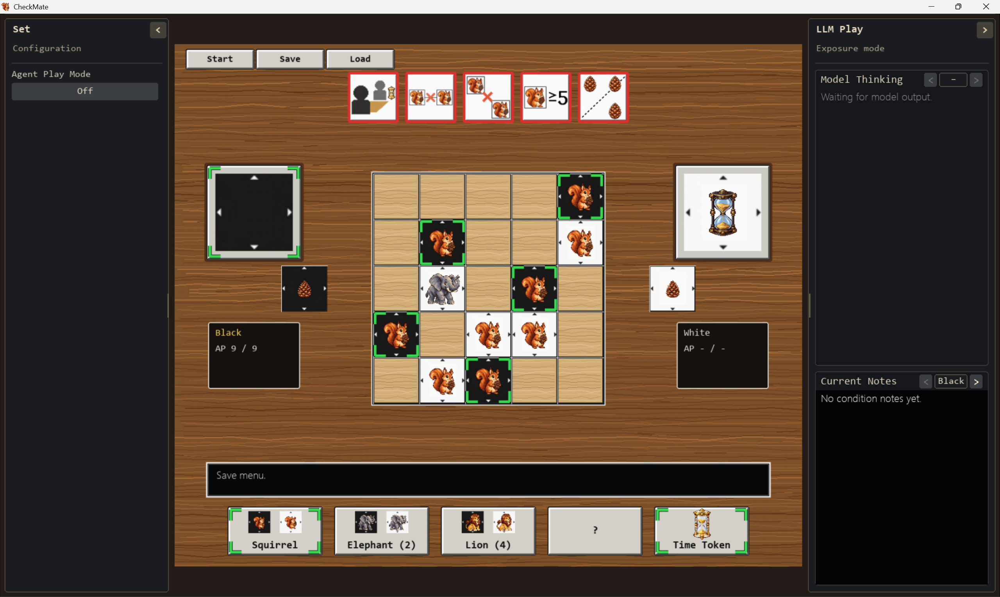
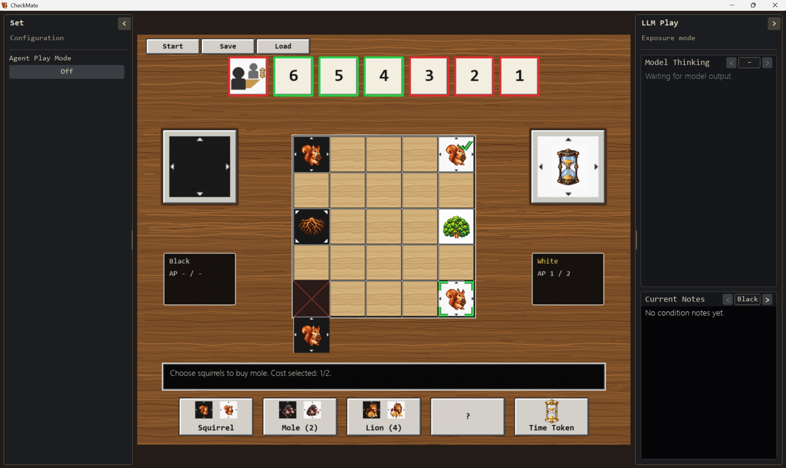
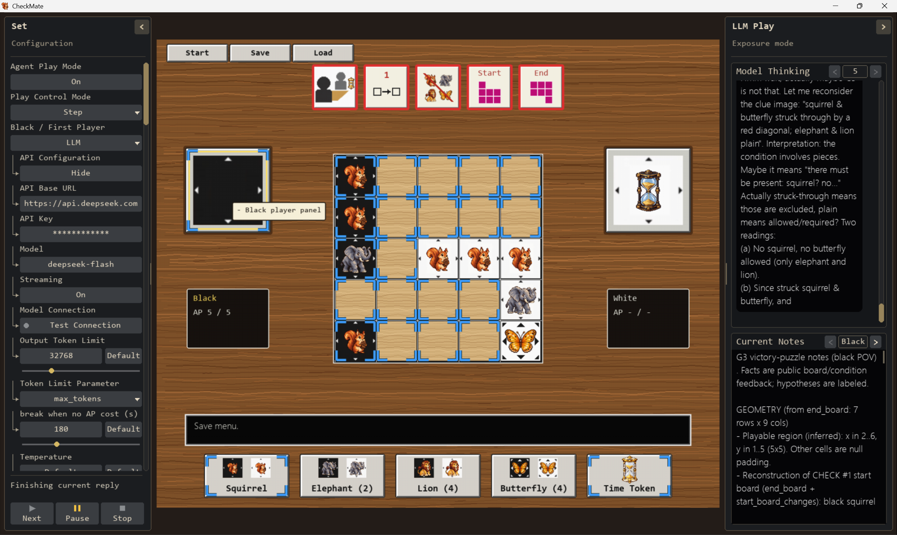

# CheckMate for Learning

A Python/Pygame board-game learning project. The current implementation supports Game 1 (G1), Game 2 (G2) and Game 3 (G3) with a local graphical interface.

## Game screenshots







## Run locally

Developed with Python 3.13. Install the dependency and start the game from the project folder:

```sh
python -m venv .venv
```

Activate the environment on Windows PowerShell:

```powershell
.\.venv\Scripts\Activate.ps1
```

Or on macOS/Linux:

```sh
source .venv/bin/activate
```

Then run:

```sh
python -m pip install -r requirements.txt
python main.py
```

The game requires a graphical desktop. The window starts maximized for G1, G2 and G3, with the complete game centered between two sidebars. The left sidebar is titled **Set** and contains Agent Play Mode, Play Control Mode (Step/Auto), Black / First Player and White / Second Player (Human/LLM). When Agent Play Mode is off, only its master switch is shown and all other settings and play controls are disabled. Selecting LLM expands that side's API configuration immediately below that player. Aligned vertical guides beside titles connect to arrow branches beside inputs to mark subordinate settings. The right sidebar shows LLM play and exposure mode. Both can be collapsed using their arrow buttons or resized by dragging the inner edge. The game scales proportionally in the remaining space, with mouse input following the displayed layout. Starting or loading another mode preserves the window and sidebar sizes. Keep the Python files and the `pic` directory together. The entry point is `main.py`. The agent interface needs no window at all:

```sh
python -c "import agenthelper; print(agenthelper.get_legal_actions(agenthelper.create_game()['session_id']))"
```

G1, G2 and G3 share the same 1200x1000 game canvas, board position, scaling and controls. All reserve one row above and below the central board for shifted corner tiles, so switching games preserves the full layout.

All three modes use five fixed bottom-button positions: Squirrel, Elephant/Mole, Lion, Butterfly/reserved, and Time Token. G1/G2 show a centered question mark in the reserved fourth position, without a click target or tooltip. G3 uses it for Butterfly. Legal-action corner marks are green for human control and blue for LLM control. They follow the full board-cell borders and remain above piece, hover and selection artwork, with a dark outline for contrast. Shifted G2 cells use the same marks. Time-token transfer highlights the current player's panel whenever that action is legal, regardless of which side currently holds the token; its shortcut stays in the fifth position. Reserve-button marks reflect the human click flow, including selecting a special piece before using its sale button. Selected purchase materials carry green checkmarks. Switching control updates the hint color and targets immediately while preserving the current position and pending transaction. Selected-piece instructions list the available movement, sale and self-activation choices; token-transfer tooltips name the resulting holder.

The exposure sidebar reserves two text panes: **Model Thinking** above (58% of the content height) and **Current Notes** below (42%). Each pane scrolls independently with the mouse wheel and follows sidebar/window resizing. Model Thinking also has a draggable vertical scrollbar. Its top-right arrows browse turns with recorded output; enter a positive turn number in the box and press Enter to jump directly. Turns without output display a message. Browsing an earlier turn preserves its scroll position while new output arrives; selecting the latest recorded turn resumes following new turns. Notes reviews appear under the turn they checked. Chinese, English and mixed text wrap within the pane; Windows uses a Chinese-capable font. The upper pane accumulates the current live game's received reasoning, replies and per-request usage. Each play request uses one bubble while receiving output and after completion: Black uses black with white text and leaves space on the right; White uses white with dark text and leaves space on the left. Failed requests and warnings use red text across the pane without a bubble. Connection-test diagnostics use ordinary text without a bubble. This history remains available when the sidebar is folded or agent mode changes. Starting or loading a game clears this runtime display history. The lower pane switches between Black and White notes using header arrows and a side label. Black's page uses white text on a black background; White's page uses dark text on a white background. Each page retains its own scroll position, and note updates preserve the selected page. Program-owned usage statistics follow the notes once a winner is known.

`agent_play.py` connects configurable OpenAI-compatible Chat Completions endpoints to the public game tools. Each side has its own API base URL, masked API key, model, Streaming switch, output token limit, token limit parameter (`max_tokens` or `max_completion_tokens`), timeout, optional temperature, optional reasoning effort and image input toggle. Enter a base URL including its API prefix (for example `/v1`) or the complete `/chat/completions` endpoint, and a provider-supported model. Clue images are supplied only to condition reviews when image input is enabled. Action requests cannot access the image tool or replace condition notes. Public rules, coordinates and tool definitions form a stable prefix. Each request supplies one authoritative current board, AP, phase, revision, pending operations and legal-action list, alongside recent actions and that side's notes. Read-tool receipts refer to this fresh context; action receipts include executed actions, revision changes, AP, phase and interruption reasons. During an unfinished decision, assistant replies, returned `reasoning_content` and every matching tool result remain paired for continuation, including after Pause or Stop. Completed decisions become deterministic action/result summaries for the current and previous own turn, then the next decision starts a fresh conversation. Reasoning display retains the provider's received output. Hidden victory predicates and internal turn records are never included.

Set provides editable **Action Prompt**, **Notes Prompt** and **NG+ Action Prompt** text boxes. Each grows with its content and uses the settings sidebar scroll. Enter inserts a newline; Ctrl+Enter or clicking outside saves; Esc cancels. Mouse selection, arrow navigation and Ctrl+A/C/X/V are supported, including Chinese and multiline pasted text (up to 65,536 characters). **Copy** copies the currently displayed text, including pending edits. Its adjacent **Restore** button restores and saves only that prompt's bundled English default. The buttons share a row and fit narrow sidebars. Restoration keeps other prompts, API settings, game state and requests already in flight; it sends no request. Changes are stored in device preferences and used by the next matching request. Empty prompts are rejected. Missing or invalid saved prompts fall back to the bundled English defaults. Prompt customization does not change the action/review tool permissions or serial scheduling. Both players share these prompts; their contexts and notes remain separate.

Model Thinking is read-only selectable output. Drag across reasoning, replies, tool calls, execution receipts, errors and diagnostics, including across messages in the displayed turn; Ctrl+C copies the original Unicode text and original newlines. Display wrapping introduces no copied line breaks. Selection highlights remain on both bubble colors. Dragging near the pane's top or bottom scrolls it automatically. Streaming additions preserve existing selection endpoints and the reading position; an active selection also holds the displayed turn when a newer turn arrives. Window and sidebar resizing preserve the selection. Explicit turn changes and a new or loaded game clear it. Clicking a settings editor gives that editor its own shortcuts; typing, cutting and pasting in Thinking never modify model output.

All program-generated interface text is English. Provider reasoning/replies, custom prompts/notes, tool names, error codes and raw API errors retain their original text. An action response is labelled **Reply received**, followed by a **tools pending** list and actual per-tool **Succeeded**/**Failed** receipts with AP, revision changes and applicable stop reasons. Queries and `record_intent` display **Read/intent tools completed; board unchanged. Continuing this decision.** Their results automatically return to the model within the authorized decision. `record_intent` stores predictions only; actual action tools execute the plan. A rejected step in `submit_plan` returns `ok: false`, retaining its executed prefix and reporting the rejected step, action and parameters. Its structured receipt also preserves legal actions and moves at rejection. Plan entries use game action types, for example `place_squirrel` with `at`, or `select_piece` with `at` followed by `move` with `from`/`to`. Usage completion records receipt of the API response separately from tool execution.

After either player's standard-game turn finishes its public victory-check animation without a winner, `note_review.py` queues one separate review request for each configured LLM side. Checks with all conditions met skip review, including before the human time wish. NG+ checks never trigger condition reviews; a decided game cancels active and queued reviews. Program-owned evidence identifies the checked player, turn, numbered condition results, starting and ending boards and public actions. Completed checks and current-turn evidence survive saves independently of editable model hypotheses; older saves retain their latest check. Requests encode historical boards as lossless cell replacements, newest first, against the current board or an identified reconstructed board. Reviews receive their completed ending board once, starting-board changes, earlier public evidence, their own notes, public rules in the stable prefix and clue images when image input is enabled. The prompt requires hypotheses to cite supporting or refuting condition IDs, checked players and turns. Only `update_notes` is offered, with default tool selection; local validation requires exactly one correct call with complete replacement notes. Text alone, gameplay calls and malformed replies fail without changing the notes. A review also preserves notes edited while it was in flight. Action requests and reviews run serially: reviews wait for the complete active action decision, including follow-up requests and tool calls; fresh action decisions wait for queued reviews to finish. In Step, pressing Next during review does not queue an action request; press Next again after review. Pause holds new reviews; Next resumes them, including during a human turn or time wish. Stop cancels active and queued reviews. Review requests count toward saved request/token usage, with a separate notes purpose, without inventing extra LLM turns.

Standard action requests read condition notes and prioritize credible victory plans; otherwise they choose informative experiments while accounting for risk and mobility. They offer `record_intent` to save a private plan and predicted numbered results (up to 2000 characters), but reject `update_notes`. Intent records do not spend AP or modify the board. The latest 32 records per side survive saves; action requests and reviews receive up to eight relevant own-side records, never the opponent's intentions. Reviews compare these predictions with executed actions and public results before replacing condition notes. Normal action requests apply existing condition notes to moves and experiments; clue interpretation and public condition evidence belong to reviews. NG+ uses a separate mate-focused action prompt and omits condition notes, clue images, intent tools and condition evidence from its normal request context.

The system prompt explicitly sets winning as the goal. In standard games, it describes victory as satisfying all special victory conditions at the end of the player's turn. NG+ notes explain that the board has no time token, so the first victory condition can never be met. They direct the player to win by mate: the opponent still has AP but has no legal action with which to spend it. Reaching zero AP normally ends the turn. Loading the previous unchanged NG+ default note upgrades its wording; model-edited notes remain intact.

The Set configuration body scrolls with the mouse wheel or its draggable vertical scrollbar; **Next**, **Pause** and **Stop** stay fixed at the bottom. Text fields support a caret, horizontal scrolling, mouse selection, Shift+arrow selection, Ctrl+A/C/X/V, word navigation/deletion and held-key repetition. Enter or clicking elsewhere commits, Esc cancels, and Tab/Shift+Tab moves between text fields. Play control mode, player type, token limit parameter and reasoning effort use dropdown menus with mouse or arrow-key/Enter selection. Output token limit (0–131072), timeout (5–600 seconds) and temperature (0–2) support both manual entry and sliders. Each numeric field has a Default button: token limit returns to 32768, timeout to 120 seconds, and temperature to the provider default. New profiles default to 32768 output tokens; existing saved limits are preserved. A zero token limit omits the parameter; blank temperature also uses the provider default. Slider previews update in memory and save local settings on release. These are UI bounds; the endpoint must support the chosen values.

**Test Connection** appears immediately after the Streaming switch, below Model. It asynchronously checks a text reply, an isolated tool call and reading that tool's returned receipt. Tool requests use default selection: the prompt asks for `connection_echo`, and local checks verify exactly one call, its name and its nonce. Tool continuation preserves the returned reasoning. With image input enabled, a separate request checks a random four-color image whose answer is absent from the text prompt. Each capability reports Passed, Failed or Skipped. A failed text check still proceeds to tools; a failed tool call skips its dependent receipt check and still proceeds to images. Disabling image input explicitly skips that stage. All stages use the side's configured endpoint, credentials, model, streaming mode and reasoning/request parameters. The indicator stays yellow while checks pass, then turns green after every enabled check passes; any failed stage turns it red while remaining independent checks continue. It is gray before testing. Detailed replies, errors, individual capability results and reported usage use ordinary text. Probes have no game tools or board context, cannot change the board and do not count toward saved game token statistics. They can run before a game starts or during initial human token placement. Changing settings, replacing the game or exiting cancels probes; Stop cancels active probes while preserving completed test indicators. API errors include the HTTP status and provider error message when available, with the configured key redacted.

**Streaming** is an On/Off click switch immediately below each Model field and above Test Connection, using the same subordinate indentation as that player's API fields. It defaults to On, including profiles saved before the switch existed, and is stored per side in local Set preferences. Off retains the complete-response request path. With streaming enabled, the upper exposure pane appends the endpoint's returned reasoning and reply to the current request's single bubble as they arrive. Completed bubbles are cached, appended text rewraps only its tail, and live display updates are batched to at most 20 per second. Scrolling away from the bottom holds the reading position; folding the sidebar keeps collecting received output in memory.

Streaming text never executes actions. Tool arguments are assembled by call index, and actions are accepted only after a completion finish reason and the SSE `[DONE]` marker. Arguments for all calls must parse before any call executes. Token-limit truncation, malformed replies, content filtering, disconnects and incomplete streams stop play and discard that reply's actions. Stop terminates the worker immediately, retaining the received text with an interruption status. Failed or stopped requests use red text without a bubble or side indentation. Pause keeps receiving the current reply and processing its final actions before holding another request.

Streaming requests ask for final usage with `stream_options.include_usage`. Reported numeric usage is recorded once at completion; when an interrupted stream or endpoint omits it, the existing unknown-usage accounting remains in effect. Fragments change only the live display and do not write saves or settings. Providers that reject streaming or its options can use Streaming Off; the runner does not silently retry a request. Complete JSON responses may omit `finish_reason`; explicit truncation or filtering still fails. The stream decoder, worker and UI use only Python's standard library and Pygame.

The **break when no AP cost (s)** setting stops an active operation decision when no AP has been spent for that duration, across all its follow-up requests. Stream text, heartbeats, public queries and intermediate selections do not reset the clock; actually spending AP does. Waiting for the user, between Step decisions or during victory animations is excluded. Reviews and each connection-test stage use the same duration as a complete-request deadline because they never spend AP. The saved profile key remains `timeout` for compatibility; the separate network I/O fallback is 600 seconds.

Multiple board-changing tool calls in one complete reply run as an ordered plan. The entire reply must match its starting board revision. Each step is checked against the latest board, and the runner advances the supplied starting revision only for changes made by that plan. Illegal steps, external changes, turn changes, butterfly extra turns and victory checks discard the remaining calls while retaining the executed prefix. Repeated request IDs retain their original effective revision so retries cannot execute twice.

In Step, **Next** authorizes one complete action decision. Queries, `record_intent`, selection, payment, refunds and elephant bonuses automatically return tool results and continue across model requests. The decision finishes after an AP-spending operation and its pending stages, all ordered actions in the current reply, or a turn/check/extra-turn boundary. Step then waits for Next; human turn completion, notes review completion and changing a player to LLM grant no action authorization. Both modes stop at 16 requests per decision, the configured no-AP-cost timeout, a text-only reply, illegal action or API failure. Queries, intent recording and selection do not reset the no-AP timer. Auto continues fresh decisions for configured LLM sides after **Next**, waiting for human turns and victory animations. Next stays green through follow-up requests and blinks when the decision finishes in an undecided game. Pause drains the current reply, then holds new requests; Next can resume the pending operation with retained context. Stop immediately cancels the local worker and discards unexecuted calls while retaining matched results. Pause, Stop, mode changes, external board changes and new or loaded games clear action authorization. If the provider reports finish_reason=length, the runner records text and usage, executes no actions from that reply and shows an English warning in Model Thinking. New launch/game starts idle. Eligible public checks trigger serial notes reviews even in Step. Read-only continuations do not trigger autosaves; usage is recorded in memory and follows the normal save policy when a decision finishes or pauses.

Initial time-token placement and the G2/G3 time wish are human only. Entering the time-wish phase stops LLM action requests and remaining actions, shows green human-action hints, and asks the user to click the token holder's panel. Model tools cannot execute the wish. Player-control preferences remain unchanged. Runtime controls cannot start LLM play until that phase is complete; model tools reject initial token placement even if called directly. NG+ starts directly in the playing phase and needs no initial placement. Requests run in an isolated process, while all board mutations run on the desktop thread. `CheckMateApp.begin_llm_request(request_id, side)` anchors each request to the displayed game. Before executing actions, `complete_llm_request(...)` records numeric usage and live output; duplicate completions and replies for a replaced game are ignored.

Set preferences and per-side API profiles are stored separately on this computer in `%LOCALAPPDATA%\CheckMate\settings.json` on Windows, restored at launch and written only when changed. API keys are encrypted with Windows DPAPI for the current Windows user; they are masked in the UI and never included in game saves, model prompts or logs. This location is independent of the source, executable and game saves, so publishing or packaging the project does not include personal configuration. A new installation with no local preferences uses the defaults. Non-Windows systems can save non-secret preferences; persistent API keys require Windows DPAPI.

Saves contain `llm_stats`: per-side and combined LLM turn/request counts, input/output/total tokens, averages per request and turn, and each request's numeric usage. Missing reported usage remains unknown and makes averages incomplete. A butterfly extra turn counts as another turn if an LLM request is issued in it. `turn_number` tracks these real turn boundaries across saves. Model reply text and action logs stay in memory; new save JSON does not include action logs or request caches. Older saves load their board and operation state without restoring their logs. Condition notes remain saved.

Built-in game labels, dialogs and tooltips use English. The text panes retain Unicode support for model output and user-provided notes.

The save-slot list is cached and refreshed after saves/loads or when opening the Save/Load menu. Ordinary automatic checkpoints write at most once per changed action state. With **Agent Play Mode** enabled, configured LLM-side actions do not update the autosave; it is updated when play returns to a human side in the playing phase, after any victory animation or pending piece-limit decision. Butterfly extra turns do not trigger a human checkpoint. With both sides configured as LLM, manual saves remain available.

## Implemented features

- G1 setup and initial time-token ownership selection.
- G2 setup, rooted/uprooted trees, diagonal tree movement, mole purchases and planting, shifting corners and seven victory conditions.
- G3 setup, butterfly movement/trades/extra turns and five victory conditions.
- Turn progression and action-point management.
- Squirrel placement, animal movement, elephant pushing and bonus placement.
- Elephant/lion purchases, payment selection, sales, refunds, and transaction cancellation.
- Lion control, piece-limit handling, and time-token actions.
- A single time-token transfer remains available when its recipient exceeds seven pieces. Every completed action enforces the holder's seven-piece limit, including elephant bonus placement, ordinary squirrel placement and completed refunds. Required removals cost no additional AP and finish before the victory check, including when AP reaches zero.
- Each side can own at most one tradable special of each kind: elephant, lion, mole and butterfly. Ownership flags are rebuilt from the board after trades, cancellations, removals and loads. Trees keep their owner/rooted state in the board and cannot be bought, sold or removed to resolve the piece limit.
- Five G1 condition checks, visual feedback and mate detection. G1 victories end directly. G2 and G3 victories enter the time-wish flow; wishing ends the game without generating continuation saves.
- Three manual save slots and one autosave slot, including action-phase restoration.
- A headless engine shared by the window and the agent interface, with revisioned actions, request de-duplication, structured errors and an action log.
- Pixel-art animal/resource icons and G1 rule diagrams.

## Game 2

Choose **Start > Start G2**. G2 starts with two squirrels and one rooted tree per side on the central 5x5 board. The outer pinecones are removed.

- Select an own tree and click it again to uproot it for 1 AP. With an own lion anywhere on the board, select an enemy tree and click it again to uproot it for 2 AP; its owner stays the same. No mole is required. Every tree counts as a piece and cannot be removed to resolve the piece limit. A rooted tree cannot move and uses a solid black or white tile without direction arrows.
- An uprooted tree moves one diagonal step into an empty playable cell for 1 AP. Its full-square black/white tile has contrasting arrows at all four corners to show the diagonal directions. A lion can move an enemy uprooted tree for 2 AP.
- When a tree leaves either initial tree position, that position gains a persistent red diamond marker, hidden under occupying pieces. With an own mole anywhere on the board, select an own uprooted tree on either red marker and click it again to plant it for 1 AP. With both an own mole and an own lion, an enemy uprooted tree can be planted there for 2 AP while keeping its owner.
- Uprooting from the left marker `[2,3]` carries the lower-left corner tile and its occupant from `[2,5]` to `[2,6]`; uprooting from the right marker `[6,3]` carries the upper-right tile from `[6,1]` to `[6,0]`. The vacated corner is a rift and cannot accept movement or placement. The extended tile remains playable. Planting restores the corner linked to that marker with its current occupant. This link follows the planting position. The board always has 25 playable cells.
- The mole replaces the elephant in the G2 shop. Buying costs 2 squirrels and 1 AP; selling costs 1 AP and refunds 1 squirrel. A mole moves one orthogonal step for 1 AP. Purchases require the time token, as in G1.
- Victory requires the opponent to hold the time token and all six distance thresholds to pass: `abs(black_x-white_x) + abs(black_y-white_y) <= 6, 5, 4, 3, 2, 1`. The corner shifts can change a carried tree's square parity, making distance 1 reachable. The last six condition cards show only the numbers 6 through 1.
- Time wishes use the existing flow and end the current game.

Before a mode is started, the four resource-button frames contain no images, labels or actions. G1, G2 and G3 populate their own shops after starting or loading.

## Game 3

Choose **Start > Start G3**. Each side starts with two squirrels and one elephant at the former tree position on the central 5x5 board.

- The butterfly costs 4 squirrels to buy and refunds 2 squirrels when sold; each trade costs 1 AP. Buying requires the time token. It moves to any of the eight adjacent empty cells for 1 AP. A lion can move an enemy butterfly for 2 AP.
- Select an own butterfly and click it again to spend 1 AP, end the current turn and check victory. If victory fails and AP remains, the same player immediately starts an extra turn with the remaining AP and time token. This does not refill AP or increase maximum AP. Starting positions and action records are reset, and new-piece movement restrictions are cleared. No butterfly can start another extra turn within that extra turn. With no AP left after activation, play passes to the opponent normally.
- A newly placed butterfly cannot move or activate its ability in that turn. Lion control applies to movement.
- Victory requires the opponent to hold the time token, exactly one movement in the turn, no ordinary squirrel placement or special-piece purchase/sale, and matching starting and ending formations. An elephant push, all carried pieces and its optional free squirrel count together as one movement; the free squirrel does not count as ordinary placement. Cancelled trades do not affect the records.
- The seven-square start pattern is `100/111/111`; the end pattern is `111/111/001`. Condition 4 accepts any 90-degree rotation and translation of the start pattern. When condition 4 passes, condition 5 requires the ending formation to be rotated 180 degrees relative to that actual starting formation, with translation allowed. When condition 4 fails, condition 5 independently accepts any rotation and translation of the end pattern. Mirroring is not accepted. All own pieces count, and extra pieces prevent a match.
- G3 turn records survive saves, including pending elephant bonuses, transactions and an extra-turn victory check. These records exist only in G3. Tree markers and corner state exist only in G2.

Automatic post-wish continuation save generation is paused. Existing saves remain loadable; earlier G2 continuation saves still skip initial token selection. Manual and ordinary autosaves continue to work.

## New Game+

The new-game menu becomes **New Game+** after a G2 or G3 time wish has ended the game and destroyed the time token. The terminal position must retain a known winner and at least one Black or White piece. Eligibility is derived from the saved mode, terminal phase, time-wish result and absent token, so loading a completed wish restores the menu. A fresh launch starts standard games.

From a qualifying position, choose **Start G1+**, **Start G2+** or **Start G3+**. Either qualifying G2 or G3 result can start any of the three target modes. The selected mode starts from its own base setup with Black to play, 1 current/maximum AP and no time token, directly in the playing phase. Tree state and G3 turn records are initialized for the new position. The source save remains available.

The user completes the G2/G3 time wish regardless of either side's Human/LLM configuration. Completing a wish displays `Save this game, then start New Game+.` Save the terminal position through the regular Save menu, then use New Game+ to select a mode.

Saves store the deciding player and action phase, so playing without a token resumes directly after loading. Initial token selection remains a distinct saved phase. No additional NG+ identity or unlock field is required; saves from older versions that lack a phase get an initial phase inferred on loading.

Run rule checks with `python -m unittest discover -s tests -v`.

New saves are written completely before replacing the destination file. After a successful write, older JSON files belonging to the same slot are removed. Saves are created locally in `saves/` when needed.

## Source files

| File | Responsibility |
| --- | --- |
| `gameengine.py` | Headless game session: phases, action execution, transactions, turn and win/mate resolution, revision and action log. No pygame import. |
| `agenthelper.py` | Restricted agent interface: session lifecycle, state snapshots, dynamic action whitelist, validated action submission and prompt-friendly summaries. |
| `agenttools.py` | Model tool whitelist bound to one live session and side, with public-only feedback, private notes and ordered plans. |
| `agent_play.py` | Cancellable streaming/non-streaming Chat Completions requests, ordered main-thread tool execution and Step/Auto/Pause/Stop control. |
| `agent_context.py` | Deterministic decision summaries, compact context receipts and lossless historical-board references. |
| `note_review.py` | Strict notes-only reviews of completed public checks and prior evidence. |
| `chat_stream.py` | Bounded SSE decoding and assembly of text, reasoning, tool arguments and final token usage. |
| `agent_prompts.py` | English prompt defaults and device-configured prompt selection. |
| `local_settings.py` | Per-user configuration outside the package, with Windows DPAPI-protected API keys. |
| `settings_widgets.py` | Single-line editing, Unicode clipboard access and shared numeric control ranges. |
| `game_rules.py` | English public instructions for the current G1, G2 or G3 game. |
| `save_policy.py` | Automatic checkpoints and deferred LLM-turn saves. |
| `llm_usage.py` | Numeric request usage, per-side totals and averages; no model text. |
| `main.py` | Desktop interface: Pygame loop, click hit-testing, condition reveal animation and human save/load orchestration. Rules live in `gameengine.py`. |
| `basicgame.py` | Board, resource, player and interaction models, plus shared action-legality helpers. |
| `game1.py` | G1 board setup, playable area and five condition checks. |
| `game2.py` | G2 setup, tree state actions, shifting corners, playable area and seven condition checks. |
| `game3.py` | G3 setup, turn records, butterfly ability eligibility and rotation-only formation checks. |
| `gui.py` | Pygame rendering, menus, legal-target highlights, tooltips and image loading. |
| `sl_func.py` | JSON serialization, save replacement, loading, slot listing and per-directory saves. |
| `ui_text.py` | English interface messages and tooltips. |

## Agent interface

### Model tools

Register only the names in `agenttools.TOOLS` with a model. These tools bind to
one game and side. `CheckMateApp.call_agent_tool(name, arguments)` operates on
the displayed board; a replaced game or changed agent setting invalidates the
previous tool binding.

| Tool | Model-visible purpose |
| --- | --- |
| `get_public_state()` | Board, playable cells, AP, token, visible pending selections, result and already revealed clue feedback. |
| `get_legal_actions()` | Immediate actions and direct `moves` (`source`, `target`, AP cost) for this model's deciding side. |
| `get_gi_rules()` | Public English instructions and shop prices for the current mode only. |
| `get_rule_images(index=None)` | Current displayed clue cards as cached in-memory PNGs; optional 1-based ordinal. No source filenames or explanatory labels. |
| `get_recent_history(limit=10)` | Executed public actions; up to 50 entries. |
| `get_notes()` / `update_notes(text)` | This side's own condition notes, preserved in normal saves. |
| `move_piece(source, target, revision, request_id)` | Select and move in one call, validated before selection. Coordinates come from `get_legal_actions().moves`; any elephant bonus or piece-limit decision is completed by the tool loop. Retries with the same ID do not move twice. |
| `apply_action(action_id, revision, request_id=None)` | One legal action, returning only public current state. |
| `submit_plan(actions, revision, request_id)` | An ordered list of `{type, params}` actions, executed one by one. |

A plan keeps its executed prefix on failure and stops on a turn change,
victory-check phase, time wish, game over or butterfly extra turn. Retrying its
request ID does not execute the prefix again. A changed plan under the same
ID is rejected. State and action replies filter internal G3 condition records;
feedback is limited to the cards already revealed in the interface. The tools
do not offer hypothetical victory evaluation, code execution, arbitrary files,
other-side notes or session-management functions.

Notes start with an inference reminder in G1, include the known opponent-token
requirement in G2/G3, and focus on mate for starts without a token. Rule cards
retain their puzzle presentation; the public instructions do not provide the
hidden victory formulas.

### Trusted Python interface

`agenthelper.py` exposes the same rules the window uses, without creating a
Pygame window or simulating clicks. All results are built from plain lists,
dictionaries and scalars, so `json.dumps` works directly; `agenthelper.dumps()`
is a convenience wrapper.

```python
import agenthelper

agenthelper.create_game(session_id="demo")
legal = agenthelper.get_legal_actions("demo")
agenthelper.apply_action("demo", legal["actions"][0]["action_id"],
                         revision=legal["revision"], request_id="r-1")
state = agenthelper.get_state("demo")
```

| Function | Purpose |
| --- | --- |
| `configure(directory=None, autosave=None)` | Change the defaults used by sessions created without explicit settings. |
| `configure_agent_play_mode(session_id, enabled, llm_colors=("white",))` | Controller-only automatic checkpoint policy for scripted sessions. |
| `create_game(session_id=None, agent_color=None, save_directory=None, gamemode=1)` | Start a G1, G2 or G3 session. `agent_color` restricts later actions to one side; `save_directory` isolates this session's files. |
| `load_session(session_id, path=None, save_directory=None)` | Restore a session from its JSON file, including pending special phases. |
| `save_session(session_id)` | Write the session to its own agent save file. |
| `list_sessions()` | List agent session files in the default directory. |
| `close_session(session_id, reason=...)` | Save and forget the live session; its file stays on disk. |
| `end_game(session_id, reason=..., loser=None, request_id=None, revision=None)` | Finish or resign a session. Ending an already finished session is a no-op that returns the current state. |
| `get_state(session_id, log_limit=10, include_board_map=True)` | Detached snapshot: revision, phase, actor, board, pending steps, result, log. |
| `get_legal_actions(session_id)` | Dynamic whitelist for the current revision: `action_id`, `type`, `params`, `label`, plus `stuck` when no legal action exists. |
| `describe_actions(session_id)` | The same list as one readable line per action. |
| `apply_action(session_id, action_id, revision, request_id=None, actor=None)` | Validate and execute one action. |
| `choose_initial_token(session_id, side, revision=None)` | Convenience wrapper for the opening token choice. |
| `cancel_action(session_id, revision=None)` | Convenience wrapper for cancel, where the phase allows it. |
| `play_action(session_id, action_type, params=None, revision=None)` | Submit by type plus parameters instead of by id. |
| `summarize(session_id, log_limit=5)` | Compact state plus action lines for building a prompt. |
| `get_coordinates(session_id=None)` | Coordinate contract and the list of actionable cells. |
| `to_jsonable(value)` / `dumps(value, indent=None)` | Convert and serialise any interface result. |

Every call returns a dictionary with `ok`. Failures add `code` and `message`
(`invalid_argument`, `unknown_session`, `no_active_game`, `unknown_action`,
`illegal_action`, `wrong_actor`, `revision_mismatch`, `request_conflict`,
`save_failed`, `load_failed`, `session_ended`) and never change the game state.

Coordinates everywhere are `[x, y]`: `x` is the column and grows to the right
(`0..8`), `y` is the row and grows downwards (`0..6`), and the origin is the
top-left cell of the 9x7 logical board. In G1 only `2 <= x <= 6` and
`1 <= y <= 5` are actionable; `get_coordinates()` reports this as data.

G2 uses the same central area with its active corner shifts. `get_coordinates(session_id)` reports all 25 currently playable cells, including extended corners and excluding rifts. State snapshots include tree `rooted` flags, `tree_markers`, `expanded_corners` (`lower_left`, `upper_right`) and the continuation's `skip_token_selection` flag. Tree actions are `uproot_tree` and `plant_tree`, each with an `at` coordinate. Mole transactions use `buy_mole` and `sell_mole`. Earlier G2 saves migrate their corner state automatically on loading.

G3 state includes `g3_turn`: starting positions, movement count, committed resource-operation flag, extra-turn flag and pending extra-turn flag. Butterfly actions are `buy_butterfly`, `sell_butterfly` and `butterfly_extra_turn` (with an `at` coordinate). State snapshots also report the derived `new_game_plus_available` value. Headless callers can use `GameSession.new_game(mode, previous_session=source)` to start a game under the same standard/NG+ rules as the desktop menu; independent `agenthelper.create_game()` calls start standard sessions.

Action ids are stable strings such as `move:from=2,1;to=2,2`,
`select_cost:at=2,3;kind=elephant` or `skip_elephant_bonus`. Always take them
from `get_legal_actions` for the revision in `get_state`.

Agent sessions are stored under `saves/agent/<session_id>/session.json`, so they
never touch the human slots in `saves/`. A pending purchase or sale is a legal,
resumable state: cancelling restores it (`cancel` is offered in the whitelist),
and saving and reloading resumes it. Time wishes finish G2/G3 without generating
a continuation save.

Guarantees worth relying on:

- The engine recomputes the whitelist for every call and re-checks revision,
  deciding side, phase and rules before executing, so a caller cannot reach a
  state the window could not reach.
- A rejected action changes nothing, and error codes are stable per failure
  kind.
- A request id is de-duplicated inside one run; reusing it with different
  content is `request_conflict`.
- `get_legal_actions()["stuck"]` is true when the position offers no legal
  action at all (for example a full board). No rule is invented for it: end the
  session with `end_game` and a reason chosen by the caller.

## Repository contents

See [GITHUB_UPLOAD.md](GITHUB_UPLOAD.md) for the current upload manifest and handoff notes.

The repository contains source code, dependency information, documentation, rule checks and the 19 images currently loaded by `gui.py`. G2 number cards, G3 condition cards and full-square directional tiles are drawn at runtime. Local environments, editor settings, saved games, logs, generated previews, artwork backups, the machine-specific launcher and unused artwork are excluded through `.gitignore`.

Mole and tree-state artwork is included for G2; a transparent golden butterfly sprite is included for G3.

To distribute the runnable source, include the 24 root-level Python modules, `pic/`'s 19 tracked PNGs and `requirements.txt`. Keep their relative locations unchanged. `README.md` and `tests/` provide documentation and regression checks; they are not needed to launch the game. Personal Set preferences live outside the project and must not be copied into a distribution.

`requirements.txt` pins the tested Pygame version, `pygame==2.6.1`. HTTP/API requests, configuration, saves and the agent worker use the Python standard library, so no additional API SDK or agent framework is required. Temporary screenshots and review scripts can be removed without affecting play or the regression suite. Unique original-art backups remain local and ignored.

## AI assistance

The original project declaration is consolidated here: GPT-6 Astra and GPT-6.1 Sol, developed by OpenAI and used through Codex, assisted with implementation discussions, data storage, project structure, framework setup, translation of comments and visible interface text from Chinese into English, complex functions and code-level testing. The project author takes responsibility for the submitted work.

Further development has used AI assistance through Codex for code changes, documentation and verification. Updated pixel-art assets and rule diagrams were generated or edited with OpenAI image-generation tools. This remains a learning project and should be reviewed against the intended game rules when extended.
